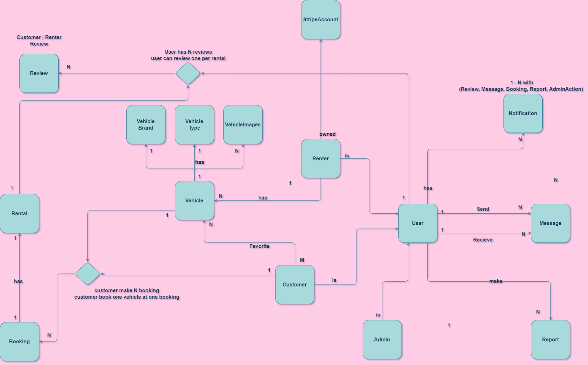

# AggarApi


## 📋 Table of Contents

- [🎯 Overview](#-overview)
- [✨ Features](#-features)
- [📅 Booking Process](#-booking-process)
- [💳 Payment System](#-payment-system)
- [🛠 Technologies](#-technologies)
- [🏗️ Architecture](#%EF%B8%8F-architecture)
- [🗄️ Database Schema](#%EF%B8%8F-database-schema)
- [🧪 Testing](#-testing)
- [🎮 Demo](#-demo)
- [📚 API Documentation](#-api-documentation)
- [📦 Installation](#-installation)
- [⚙️ Environment Configuration](#%EF%B8%8F-environment-configuration)
- [📞 Contact](#-contact)


---


## 🎯 Overview
Aggar API is a scalable and robust backend that powers a full-featured Aggar app. It connects vehicle owners (renters) with customers looking to book vehicles, handling all core operations, including vehicle listings, booking management, user accounts, and real-time messaging and notifications.

The system ensures secure transactions through escrow payment system, holding funds until rentals are confirmed. An integrated admin dashboard enables management of reports, users, and platform analytics, supporting safe and transparent operations.

Designed for reliability, the backend supports real-time communication, role-based access control, and a structured end-to-end booking flow.

---


## ✨ Features

### 🔐 Authentication
- **Secure registration with email verification:** Users must confirm their email using a code sent to their inbox before gaining access.

- **JWT-based authentication:** Short-lived access tokens and long-lived refresh tokens power a stateless login system.

- **Token refresh endpoint:** Keeps users logged in securely without frequent re-authentication.

- **Protected endpoints:** Sensitive routes are secured based on authentication and role level.


### 👥 User Management

- **Role-Based Access**: Supports three roles Customer, Renter, and Admin, each with different permissions and access levels.

- **Profile Management**: Users can view and update their profile details, including personal information and profile image.

- **Activity History**: Users can access their full history, including booking records, rental activity, and reviews they've written.

- **Submit reports**: Users can report inappropriate behavior or content (e.g., reviews, vehicles, users, messages).

- **Review system**: During rentals, customers and renters can leave reviews and ratings for each other.


### 👤 Customer Features

- **Saved Vehicles**: Customers can save vehicles to their favorites list and access them later from their profile.

- **Browse & Search Vehicles**: Customers can explore available vehicles, prioritized by proximity to their location. The search supports advanced filtering (by location, price, brand, model, vehicle type, and more) to help users find the right vehicle quickly and easily.


### 👤 Renter Features

- **Vehicle Management**: Renters can add, edit, or remove vehicles from their listings.

- **Booking Requests**: Renters receive incoming booking requests from customers and can either accept or reject them through a structured approval process.

- **Availability Calendar**: Renters can view a calendar that highlights booked days across all their vehicles, making it easy to track availability and manage future bookings.

- **Payout Overview**: Renters can view their payout details including upcoming and past payouts, booking earnings breakdown, and stripe account info.


### 🛡️ Admin Dashboard

- **Report Management**: View and respond to user-submitted reports related to inappropriate content or behavior.

- **User Moderation**: Issue warnings to users for violating platform rules.

- **Role Distribution Insights**: Visual analytics showing percentages of Customers and Renters.

- **Platform Earnings Overview**: Track revenue generated from booking commissions and platform fees.

- **Manage Vehicle Brands & Types**: Admins can add, edit, or remove vehicle brands and types to maintain a clean and accurate selection list for users.


### 🚗 Vehicle Management

#### 1. Add & Manage Vehicles  
Renters can add, edit, or remove their vehicles, each vehicle includes:
- **Basic Info**: Brand, model, year, color, type, etc..
- **Specifications**: Transmission type, number of seats
- **Pricing**: Daily rental price
- **Overview**: Short written details about the vehicle
- **Photos**: One required mian image and optional multiple image uploads to showcase the vehicle

#### 2. Location Tagging  
Renters must set a pickup location when registering a vehicle.  
- The location is used for:
  - **Search filters** so customers can find the nearest available vehicles
  - **Booking coordination**, helping customers easily reach the pickup point

#### 3. Discount Rules  
Renters can configure **dynamic discounts** based on the number of booking days:
- Examples:  
  - 5% off for rentals of 3 days or more  
  - 10% off for rentals of 7 days or more

  
### ⭐ Review and Rating System

After the rental, both customers and renters can review each other.  
The review system uses both **shared** and **role-specific** rating criteria to ensure fairness and context-aware feedback.  
Each user submits a review and star ratings:

- **Shared Rating Criteria**:
  - **Punctuality**: Timeliness during pickup and drop-off
  - **Behavior**: Respectful and cooperative communication

- **Customer-Specific Ratings**:
  - **Truthfulness**: Accuracy of the renter's description about the vehicle (pyhisical status, features, etc.)

- **Renter-Specific Ratings**:
  - **Vehicle Care**: How well the customer treated the vehicle during the rental

- **Overall User Rating**:  
  - Each user's total rating is automatically calculated as the average of all ratings received across completed rentals.


### 🔔 Notifications

- Users receive **real-time notifications** for:
  - Booking and Rental updates (accepted, rejected, canceled, confirmed)
  - Payment status
  - Warnings or admin actions

- Supports both **in-app** and **email notifications** for critical events.


### 💬 Real-Time Chat

- Customers and renters can **chat directly** within the app.
- Helps coordinate pickup/drop-off and clarify any questions before rental.


### 🚨 Report & Warning System

#### 1. Reporting  
- Users can **report**:
  - Offensive messages  
  - Inappropriate user behavior  
  - Use of bad language  
- Each report includes:
  - The item being reported (e.g., message, vehicle, user)  
  - A reason or explanation from the reporter

#### 2. Admin Actions  
- Admins can:
  - View and manage all submitted reports  
  - Issue warnings to users based on violations

#### 3. Auto-Ban Rule  
- Users are **automatically banned** after reaching a predefined number of **active warnings**.


### ⚙️ Performance Optimization

- **Caching**: Improves performance by storing frequently accessed data, reducing unnecessary database queries and speeding up response times.

---

## 📅 Booking Process

#### 1. Initiate Booking
- The customer selects a vehicle and specifies:
  - **Start Date & Time**
  - **End Date & Time**

- The system checks vehicle availability:
  - If **unavailable**, the request is rejected immediately.
  - If **available**, the system responds with:
    - Total rental duration (in days)
    - Total price
    - Any applicable **discounts**


#### 2. Renter Response
- The booking request is sent to the **renter**.
- The renter can:
  - **Accept** or **Reject** the booking.
- If the renter does **not respond before the start date**, the booking is **automatically canceled**.
- The customer can **cancel** the request at any time before payment.


#### 3. Customer Payment
- If the renter **accepts**, the customer must:
  - **Confirm and complete payment** within **3 days** of acceptance.
- Upon successful payment:
  - A **rental record** is created.
  - The **payment is held** securely in an **escrow** system.
  - The renter receives a **QR code** via email to verify the rental start.
- **Platform Fee**:  
  The platform deducts a service fee from each successful booking.


#### 4. Cancellations & Refund
- **Before payment**: The customer can cancel the booking at any time without penalty.
- **After payment and before QR confirmation**: 
  - If the customer cancels, a **penalty fee** may be applied to compensate the renter.
- **After QR confirmation**: 
  - No refunds are issued, as the rental is considered started and confirmed.


#### 5. Rental Confirmation (QR Code Scan)
- On the rental start date:
  - The customer and renter meet in person.
  - The customer **scans the QR code** to confirm handover.
- Once scanned:
  - The **payment is released** from escrow to the renter’s account.


---

## 💳 Payment System

The platform uses **Stripe** to handle all payment and payout processes securely and efficiently.

### 1. Renter Payment Account Setup
- Every renter must **create a Stripe Connected Account** inside the platform.
- During this process, renters provide **personal and bank information** required by Stripe for payouts.
- **Sensitive information is never stored** on our servers, it is securely **sent directly to Stripe** using their encrypted onboarding flow.


### 2. Escrow-Based Booking Payment
- When a customer confirms a booking, payment is **held in escrow** by the platform's Stripe account.
- Once the rental starts and the **QR code is scanned**, the payment is released to the renter's connected account.
- Stripe then processes a **payout to the renter’s bank account** within **3 business days**.

### 3. Platform Earnings (App Tax)
- The platform takes a **fixed percentage** (e.g., 10%) as a service fee from each transaction.
  - Example: On a $100 booking, the renter receives $90 and the platform takes $10.

### 4. Refund Policy
- Refunds are allowed under specific conditions and penalties.
- In case of eligible refunds, Stripe reverses the payment before it is released to the renter.

### 5. Webhook Verification
- Stripe **webhooks** are used to track:
  - Payment success/failure
  - Account creation status
  - Payouts and refunds
- Ensures full traceability and real-time status updates.

### 6. Security & Compliance
- All transactions are handled through **Stripe’s secure infrastructure**.
- The system follows **KYC (Know Your Customer)** and **financial regulations** enforced by Stripe.

---

## 🛠 Technologies

The platform is built using a robust and modern tech stack:

- **Backend Framework**: ASP.NET Core Web API 9  
- **Database**: SQL Server  
- **ORM**: Entity Framework Core (EF Core) & Dapper  
- **Authentication**: JWT Bearer Tokens  
- **Real-Time Communication & Notifications**: SignalR  
- **Object Mapping**: AutoMapper  
- **Background Jobs**: Hangfire  
- **Payment Processing**: Stripe Payment Gateway  
- **Background Processing**: Worker Service

---

## 🏗️ Architecture

The project follows a **Modular Clean Architecture** approach using a multi-project solution for better separation of concerns and maintainability.

#### 📁 Projects Structure

- **API**: Handles HTTP requests and application entrypoint  
  - **Controllers**: Handle incoming HTTP requests and return responses.  
  - **Hubs**: Manage SignalR hubs for real-time communication and notifications.  
  - **`wwwroot`**: Stores static files and email templates.  
  - **Startup Configuration**: Program.cs and service setup.  
  - References `Core`  

- **Core**: Contains Business Logic and Service Layer  
  - **Services**: Business logic implementations and interfaces.  
  - **DTOs**: Data transfer objects used between layers.  
  - **Background Job Services**: Definitions for Hangfire background tasks.  
  - References `Data`  

- **Data**: Manages Database and Persistence Layer  
  - **Models**: Represent database tables and enums.  
  - **DbContext**: EF Core context for database access.  
  - **Repositories**: Manage data access using repository interfaces and implementations.  
  - **Configurations**: Fluent API mappings for entity relationships and constraints.  
  - Implements Repository Pattern and Unit of Work  

- **APIWorker**: Runs background and scheduled tasks  
  - Cleans up expired or revoked tokens and other unwanted records to maintain database integrity.  
  - Uses **Dapper** for fast, lightweight, and efficient SQL operations.

- **UnitTests**: Provides Unit Testing Support.


#### 🔧 Patterns & Practices

- **Dependency Injection** is used for all services and repositories  
- **Repository Pattern** and **Unit of Work** encapsulate DB logic  
- **Separation of Concerns** ensures independent testing and development  

---

## 🗄️ Database Schema

### ERD
  

### Mapping
  

---

## 🧪 Testing
Unit tests are implemented using:
- NUnit
- Moq
- SQL Server InMemory

---

## 🎮 Demo
- [Aggar Video Demo](https://drive.google.com/file/d/1_2l2ve63Zk_gnS7YvD_0qFqXAELZ2JS4/view)

---

## 📚 API Documentation
- [Postman Collection](https://aggarteam.postman.co/workspace/Aggar-Api~7a5396af-3167-413a-ac62-662269cebdf4/collection/33136211-40ce7740-c3ef-45f5-85d6-72cdda60ad99?action=share&creator=31250760)
- [Swagger Documentation](https://aggarapi.runasp.net/swagger/index.html)

---

## 📦 Installation
### 1. Clone the repository:
``` bash
git clone https://github.com/Aggar-rent-a-ride/AggarApi.git
cd AggarApi
```
### 2. Restore dependencies:

```bash
dotnet restore
```

### 3. Build the solution:

``` bash
dotnet build
```
### 4. Run database migrations:

```bash
dotnet ef database update
```

### 5. Run the application:

``` bash
dotnet run --project AggarApi
```

---

## ⚙️ Environment Configuration
Create `appsettings.Development.json` or update `appsettings.json`.
🔐 **Sensitive values** like API keys and secrets should be stored securely

``` json
{
  "ConnectionStrings": {
    "Hangfire": "",
    "SQLServer": ""
  },
  "EmailSettings": {
    "EmailAddress": "",
    "Password": ""
  },
  "JWT": {
    "Key": "",
    "Issuer": "",
    "Audience": "",
    "DurationInHours": 
  },
  "Stripe": {
    "SecretKey": "",
    "PublishKey": "pk_test_...",
    "WebhookSecret": ""
  },
  "Secret": {
    "SecretKey": "",
    "QrSecretKey": ""
  }
},
"Logging": {
    "LogLevel": {
      "Default": "Information",
      "Microsoft.AspNetCore": "Warning"
    }
  },
  "Serilog": {
    "Using": [ "Serilog.Sinks.Console", "Serilog.Sinks.File" ],
    "MinimumLevel": "Information",
    "WriteTo": [
      {
        "Name": "Console",
        "Args": {
          "restrictedToMinimumLevel": "Information"
        }
      },
      {
        "Name": "File",
        "Args": {
          "path": "logs/app-log-.json",
          "rollingInterval": "Day",
          "restrictedToMinimumLevel": "Warning",
          "formatter": "Serilog.Formatting.Json.JsonFormatter, Serilog"
        }
      }
    ]
  },
  "AllowedHosts": "*",
  "EmailSettings": {
    "SmtpHost": "smtp.gmail.com",
    "SmtpPort": 587,
    "DisplayName": "Aggar"
  },
  "GeoapifyAddressRequest": {
    "BaseUrl": "https://api.geoapify.com/v1/geocode/reverse",
    "Lat": 0,
    "Lon": 0,
    "Limit": 1,
    "Lang": "en",
    "Format": "json",
    "Type": "street"
  },
  "Paths": {
    "VehicleImages": "Images/Vehicles",
    "MessageFiles": "Files/Messages",
    "VehicleBrands": "Images/VehicleBrands",
    "VehicleTypes": "Images/VehicleTypes",
    "Profiles": "Images/Profiles"
  },
  "WarningManagement": {
    "MaxWarningsCount": 3,
    "MaxTotalWarningsCount": 3
  },
  "PaymentPolicy": {
    "FeesPercentage": 10,
    "AllowedConfirmDays": 2,
    "AllowedRefundDaysBefore": 5,
    "RefundPenalityPercentage": 20
  }

```

---

## 📄 License
This project is licensed under the MIT License.

---

## 📞 Contact
For questions or feedback, feel free to reach out:
- mohamedsaid3403@gmail.com
- omarnaru2002@gmail.com
